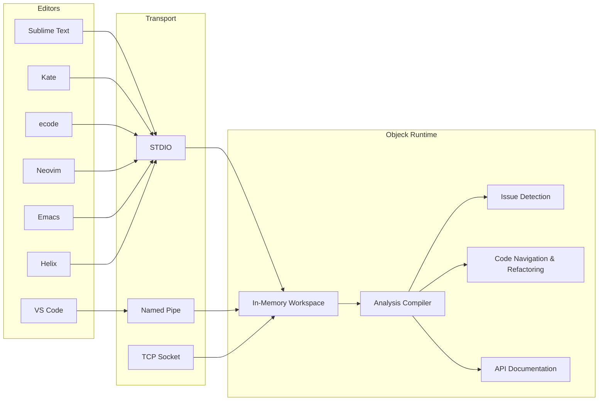

<p align="center">
<strong>Objeck LSP</strong><br>
Language Server Protocol support for <a href="https://github.com/objeck/objeck-lang">Objeck</a><br>
Code intelligence for 7 editors across Windows, Linux, and macOS
</p>

<hr/>

<p align="center">
  <a href="https://github.com/objeck/objeck-lsp/releases"></a>
  <a href="https://github.com/objeck/objeck-lsp/issues"></a>
  <a href="https://github.com/objeck/objeck-lsp/blob/main/LICENSE"></a>
</p>

## Overview

The Objeck LSP server provides code intelligence for the [Objeck](https://github.com/objeck/objeck-lang) programming language. Diagnostic functionality (compiling, symbol lookup, completion, etc.) is built into libraries that ship with the toolchain. The server is standalone, written in Objeck, and supports **STDIO**, **TCP**, and **named pipe** transports.

## Features

- **Diagnostics** &mdash; Real-time error and warning reporting
- **Code Completion** &mdash; Variables, methods, and functions with trigger characters (`@`, `.`, `>`)
- **Signature Help** &mdash; Method/function parameter hints
- **Hover** &mdash; Bundle documentation on hover
- **Go to Definition / Declaration** &mdash; Navigate to variables, classes, and methods
- **Find References** &mdash; Locate all usages of a symbol
- **Rename** &mdash; Project-wide variable and method renaming
- **Document Symbols** &mdash; Classes, enums, and methods outline
- **Workspace Symbols** &mdash; Search across all project files
- **Code Actions** &mdash; Quick fixes (add `use` statements, qualify references)
- **Formatting** &mdash; Document and range formatting
- **Multi-root Workspaces** &mdash; JSON-configured project support via `build.json`

## Supported Editors

| Editor | Transport | Config Location |
|--------|-----------|-----------------|
| **VS Code** | Named pipe | Built-in ([`.vsix` extension](https://github.com/objeck/objeck-lsp/releases)) |
| **Sublime Text** | STDIO | [`clients/sublime/`](clients/sublime/) |
| **Kate** | STDIO | [LSP Client settings](README.txt) |
| **ecode** | STDIO | [`lspclient.json`](README.txt) |
| **Neovim** (0.11+) | STDIO | [`clients/neovim/`](clients/neovim/) |
| **Emacs** (29+) | STDIO | [`clients/emacs/`](clients/emacs/) |
| **Helix** | STDIO | [`clients/helix/`](clients/helix/) |

## Platform Support

| Platform | Architecture |
|----------|--------------|
| **Windows** | AMD64 |
| **Linux** | AMD64, ARM64 |
| **macOS** | AMD64, ARM64 |

## Quick Start

**1. Install Objeck** from [github.com/objeck/objeck-lang](https://github.com/objeck/objeck-lang/releases/latest)

**2. Set environment variables** (required for STDIO transport):
```sh
export OBJECK_LIB_PATH=/usr/local/objeck/lib
export OBJECK_STDIO=binary
```

**3. Configure your editor** &mdash; see the [Install Guide](docs/install_guide.html) or [README.txt](README.txt) for step-by-step instructions.

**4. Create a workspace** &mdash; add a `build.json` to your project root:
```json
{
  "files": ["main.obs", "helper.obs"],
  "libs": ["gen_collect.obl", "net.obl", "json.obl"],
  "flags": ""
}
```

Open the folder in your editor and the LSP server will handle the rest.

## Architecture



## See It In Action

<table>
<tr>
<td width="50%">
<strong>Error Checking</strong><br>

</td>
<td width="50%">
<strong>Code Completion</strong><br>

</td>
</tr>
<tr>
<td colspan="2" align="center">
<strong>Variable and Method Renaming</strong><br>

</td>
</tr>
</table>

## LSP Protocol Coverage

<details>
<summary><strong>Notifications</strong></summary>

| Event | Method |
|-------|--------|
| Initialized | `initialized` |
| Cancel Request | `$/cancelRequest` |
| File Open | `textDocument/didOpen` |
| File Changed | `textDocument/didChange` |
| File Save | `textDocument/didSave` |
| File Close | `textDocument/didClose` |
| Exit | `exit` |

</details>

<details>
<summary><strong>Requests</strong></summary>

| Feature | Method |
|---------|--------|
| Initialize | `initialize` |
| Shutdown | `shutdown` |
| Completion | `textDocument/completion` |
| Document Symbol | `textDocument/documentSymbol` |
| Workspace Symbol | `workspace/symbol` |
| Signature Help | `textDocument/signatureHelp` |
| References | `textDocument/references` |
| Definition | `textDocument/definition` |
| Declaration | `textDocument/declaration` |
| Rename | `textDocument/rename` |
| Hover | `textDocument/hover` |
| Code Action | `textDocument/codeAction` |
| Format Document | `textDocument/formatting` |
| Format Selection | `textDocument/rangeFormatting` |

</details>

<details>
<summary><strong>Workspace</strong></summary>

| Feature | Method |
|---------|--------|
| Watch File Changes | `workspace/didChangeWatchedFiles` |
| Workspace Folder Changes | `workspace/didChangeWorkspaceFolders` |
| Find Symbol | `workspace/symbol` |

</details>

## Development

**Building the VS Code extension:**
```sh
npm install -g yo generator-code typescript @vscode/vsce
cd clients/vscode && npm run compile
```

**Building the LSP server** (requires [Objeck](https://github.com/objeck/objeck-lang)):
```sh
cd server
obc -src frameworks.obs,proxy.obs,server.obs,format_code/scanner.obs,format_code/formatter.obs \
    -lib diags,net,json,regex,cipher -dest objeck_lsp.obe
```

## Resources

- [Install Guide](docs/install_guide.html) &mdash; detailed setup for all editors
- [README.txt](README.txt) &mdash; quick-reference setup instructions
- [Objeck Language](https://github.com/objeck/objeck-lang) &mdash; compiler, runtime, and documentation
- [Issues](https://github.com/objeck/objeck-lsp/issues) &mdash; bug reports and feature requests
