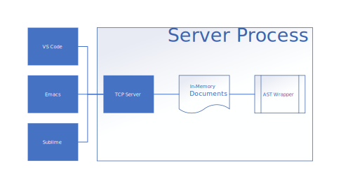
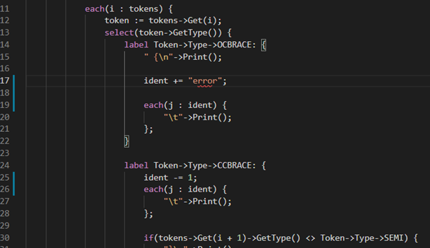
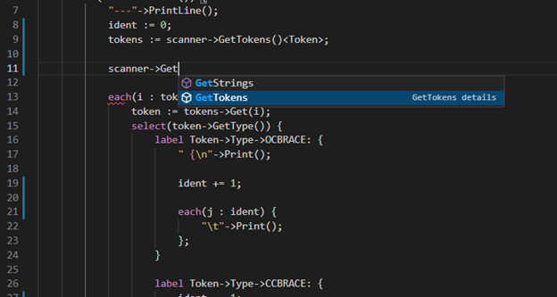
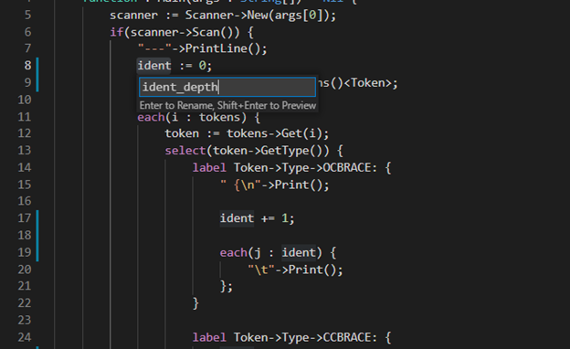

# Objeck LSP
LSP support for [Objeck](https://github.com/objeck/objeck-lang) was incorporated into v6.0 (and futher releases). Diagnostic functionality (i.e. compiling code, finding symbols, code completion, etc.) is built in libraries that ship with the tool chain. The [LSP](https://microsoft.github.io/language-server-protocol/specification) server is standalone, written in Objeck and exposes a TCP socket interface. The backend handles client requests, formats responses and maintains the state of in-memory documents.

## Upcoming Updates
Reviving this effort to provide the following
1. ~~Better support for Sublime and other text editors (current implementation is based on message ordering from VSCode)~~
2. ~~STDIO support for Sublime and other text editors~~
3. Named pipe support for VSCode

#### Notifications
* Initialized `initialized`
* Cancel Request `$/cancelRequest`
* File Open `textDocument/didOpen`
* File Changed `textDocument/didChange`
* File Save `textDocument/didSave`
* File Close `textDocument/didClose`
* Workspaces
  * JSON configured workspaces to support multi-file projects
  * Find symbol in workspace `workspace/symbol`
  * Watch file changed `workspace/didChangeWatchedFiles`
  * Watch workspace changed `workspace/didChangeWorkspaceFolders`

#### Callbacks
* Initialize `initialize`
* Code completion `textDocument/completion`
* Code resolution `completionItem/resolve`
* Code symbol `textDocument/documentSymbol`
* Method/Function signature help `textDocument/signatureHelp`
* Goto code references `textDocument/references`
* Goto code definitions `textDocument/definition`
* Goto code declaration `textDocument/declaration`
* Variable rename `textDocument/rename`
* Format document `textDocument/formatting`
* Format selection `textDocument/rangeFormatting`
* Editor shutdown `shutdown`

<figure>
<figcaption>Fig.1 - Error checking</figcaption>

</figure>

<figure>
<figcaption>Fig.2 - Code completion</figcaption>

</figure>

<figure>
<figcaption>Fig.3 - Variable and method renaming</figcaption>

</figure>

## Project Status
The server is functional but there is still work to do.

### Functional
1. Tested editors
    1. Visual Studio Code
    2. Sublime
    3. Kate
1. Platform support
    1. Windows (AMD64)
    2. Linux (AMD64 and ARM64)
    3. macOS (AMD64 and ARM64)
2. Multi-document support
    1. Project workspaces
4. Code symbols
    1. Classes
    2. Enums
    3. Methods    
5. Finding references
    1. Variables
6. Finding declarations
    1. Variables
    2. Methods and functions
7. Finding definitions
    1. Variables (done)
    2. Classes and method (done)
8. Keyword completion
    1. Variables
    2. Methods and functions
9. Bundle documentation
10. Quick Fixes
    1. Add 'use' a statment for an unqualfied class
    2. Qualfied an unqualfied class
    
### Outstanding
1. Auto include libraries based upon 'use' statements
     1. In Beta for v6.9.0
3. Linting
     1.Dead code
4. Testing with Emacs
