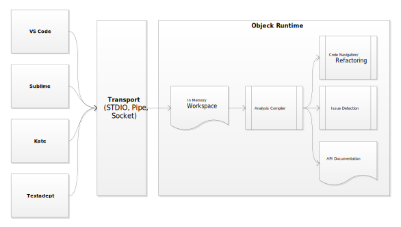

# Objeck LSP
LSP support for [Objeck](https://github.com/objeck/objeck-lang) was incorporated into v6.0 (and futher releases). Diagnostic functionality (i.e. compiling code, finding symbols, code completion, etc.) is built in libraries that ship with the tool chain. The [LSP](https://microsoft.github.io/language-server-protocol/specification) server is standalone, written in Objeck and exposes STDIO and TCP interfaces. The backend handles client requests, formats responses and maintains the state of in-memory documents.

Please refer to the installation [instructions](https://github.com/objeck/objeck-lsp/blob/main/README.txt) (and issues reports) for editor support. A detailed HTML install guide is also available in [docs/install_guide.html](docs/install_guide.html).

## Work in the Queue
Reviving this effort to provide the following
1. ~~Improved VSCode support~~
1. ~~Named pipe support for VSCode~~
1. ~~Increased stability~~
1. ~~Project/workspace build support for non-VSCode clients~~
1. ~~Better support for Sublime and other text editors (current implementation is based on message ordering from VSCode)~~
1. ~~STDIO support for Sublime and other text editors~~



##  Environment Setup ## 
These are the instructions to set up the environment to build and package the Objeck 

LSP plugin

1. To set up npm (Node Package Manager) for Windows and install the necessary packages to build VS Code plugins (extensions), follow these steps:

**Step 1: Install Node.js and npm**
- npm is bundled with Node.js, so installing Node.js will also install npm.
1. Go to the Node.js download page (https://nodejs.org).
2. Download the Windows installer (choose the LTS version for stability).
3. Run the installer and follow the prompts, making sure npm is checked.
4. After installation, open Command Prompt and run:
   ```sh
   node --version
   npm --version
   ```
   to confirm they are installed successfully.

**Step 2: Install Visual Studio Code Extension Generator**
- Most VS Code extensions are built with the Yeoman generator for VS Code, along with supporting tools.
1. Install Yeoman and VS Code Extension Generator globally:
   ```sh
   npm install -g yo generator-code
   ```
2. To scaffold a new extension, you can then run:
   ```sh
   yo code
   ```

**Step 3: Common Packages Needed for VS Code Plugins**
While `yo` and `generator-code` set up a new extension, you might also need:
- Typescript (many extensions are written in TypeScript):
  ```sh
  npm install -g typescript
  ```
- vsce (for packaging and publishing extensions):
  ```sh
  npm install -g @vscode/vsce
  ```

**Summary of npm commands:**
```sh
npm install -g yo generator-code typescript @vscode/vsce
```
## Supported LSP Events ##

#### Notifications
* Initialized `initialized`
* Cancel Request `$/cancelRequest`
* File Open `textDocument/didOpen`
* File Changed `textDocument/didChange`
* File Save `textDocument/didSave`
* File Close `textDocument/didClose`

#### Callbacks
* Initialize `initialize`
* Code completion `textDocument/completion`
* Code resolution `completionItem/resolve`
* Code symbol `textDocument/documentSymbol`
* Method/Function signature help `textDocument/signatureHelp`
* Goto code references `textDocument/references`
* Goto code definitions `textDocument/definition`
* Goto code declaration `textDocument/declaration`
* Variable rename `textDocument/rename`
* Format document `textDocument/formatting`
* Format selection `textDocument/rangeFormatting`
* Editor shutdown `shutdown`

#### Workspaces
  * JSON configured workspaces to support multi-file projects
  * Find symbol in workspace `workspace/symbol`
  * Watch file changed `workspace/didChangeWatchedFiles`
  * Watch workspace changed `workspace/didChangeWorkspaceFolders`

<figure>
<figcaption>Fig.1 - Error checking</figcaption>

</figure>

<figure>
<figcaption>Fig.2 - Code completion</figcaption>

</figure>

<figure>
<figcaption>Fig.3 - Variable and method renaming</figcaption>

</figure>

## Project Status
The server is functional but there is still work to do.

### Functional
1. Tested editors
    1. Visual Studio Code
    2. Sublime
    3. Kate
    4. ecode
    5. Neovim
    6. Emacs
    7. Helix
1. Platform support
    1. Windows (AMD64)
    2. Linux (AMD64 and ARM64)
    3. macOS (AMD64 and ARM64)
2. Multi-document support
    1. Project workspaces
4. Code symbols
    1. Classes
    2. Enums
    3. Methods    
5. Finding references
    1. Variables
6. Finding declarations
    1. Variables
    2. Methods and functions
7. Finding definitions
    1. Variables (done)
    2. Classes and method (done)
8. Keyword completion
    1. Variables
    2. Methods and functions
9. Bundle documentation
10. Quick Fixes
    1. Add 'use' a statment for an unqualfied class
    2. Qualfied an unqualfied class
    
### Outstanding
1. Additional testing and feedback
